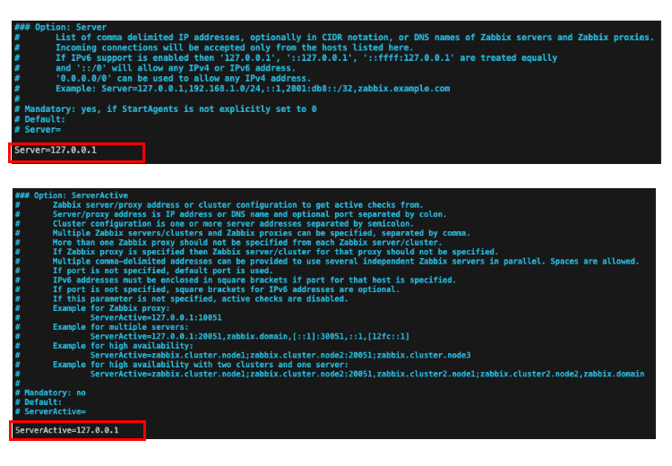
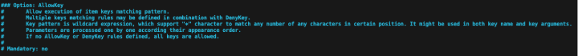

# Podman Composeを利用したZabbixの実験環境

 

# 起動方法

以下のコマンドで環境が起動するので、起動後にlocalhost:8080にアクセスしてください。

```bash
podman compose up -d
```

初期アカウントは以下の通りです。

```text
User: Admin
Password: zabbix
```

また、以下のコマンドで停止します。

```bash
podman compose down
```

# 初回起動時の設定

## Zabbixサーバー監視用のエージェント設定

Zabbixサーバーにはエージェントがインストールされていません。
そのため初回起動時には、存在しないエージェント経由でサーバーの状態を取得しようとして失敗します。

そこで、Zabbixサーバー情報取得をサーバー上のエージェント経由ではなく、composeで起動したエージェント経由で行うように設定します。


# エージェントを使った監視

zabbix-targetというコンテナにzabbix-agentをインストールしているので、
zabbix-targetの情報をzabbix-agent経由で取得してみます。

以降の設定は、zabbix-targetコンテナ内で行います。

## 設定の変更

/etc/zabbix/zabbix_agentd.confを修正します。
今回は、エージェントで最低限の実験をするための設定だけを行います。

まずは、エージェントと通信するZabbixサーバの設定を行います。
最初に以下の２箇所を修正して、Zabbixサーバーのコンテナに書き換えます。



変更した結果は以下の通りです。

```text
Server=zabbix-server
ServerActive=zabbix-server
```

続いて、Zabbixエージェントが監視対象ホストに対してsystem.run[]で実行できるコマンドを設定します。
今回は実験なので、すべてのコマンドを実行できるようにします。
以下の記述の下に一行追加してください。



追加する行は以下の通りです

```text
AllowKey=system.run[*]
```

もし、zabbix-agentが起動中の場合は、再起動して設定を反映させてください。

```bash
service zabbix-agent restart
```


## zabbix-agentの起動

zabbix-targetコンテナにアクセスして、以下のコマンドでzabbix-agentを起動します。

```bash
service zabbix-agent start
```

## ホストの作成とアイテムの作成

### ホストの作成


### 監視項目の作成


# 参考

- [Zabbix公式マニュアル](https://www.zabbix.com/jp/manuals)
- [Zabbixサーバー(PostgreSQL)のコンテナイメージ](https://hub.docker.com/r/zabbix/zabbix-server-pgsql)
- [Zabbixインターフェース(nginx)のコンテナイメージ](https://hub.docker.com/r/zabbix/zabbix-web-nginx-pgsql/)
- [PostgreSQLのコンテナイメージ](https://hub.docker.com/_/postgres)
- [Zabbixエージェントのコンテナイメージ](https://hub.docker.com/r/zabbix/zabbix-agent/)