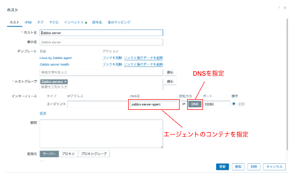
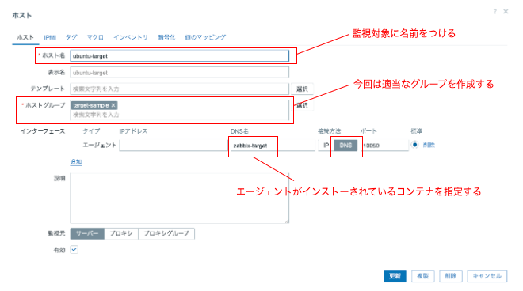
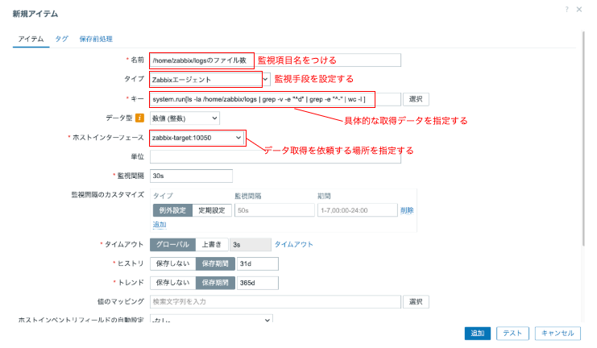

# Podman Composeを利用したZabbixの実験環境

 

# 起動方法

以下のコマンドで環境が起動するので、起動後にlocalhost:8080にアクセスしてください。

```bash
podman compose up -d
```

初期アカウントは以下の通りです。

```text
User: Admin
Password: zabbix
```

また、以下のコマンドで停止します。

```bash
podman compose down
```

# 初回起動時の設定

## Zabbixサーバー監視用のエージェント設定

Zabbixサーバーにはエージェントがインストールされていません。
そのため初回起動時には、存在しないエージェント経由でサーバーの状態を取得しようとして失敗します。

そこで、Zabbixサーバー情報取得をサーバー上のエージェント経由ではなく、composeで起動したエージェント経由で行うように設定します。



# エージェントを使った監視

zabbix-targetというコンテナにzabbix-agentをインストールしているので、
zabbix-targetの情報をzabbix-agent経由で取得してみます。

## ホストの作成とアイテムの作成

ZabbixのWeb画面から設定を行います。

### ホストの作成



ホストはいわゆる実在するホストのことではなく、Zabbixサーバが監視対象につける任意の名前です。
実施にどこからデータを取得するかは、インターフェース部分で設定します。

インターフェースは複数設定することができ、監視項目ごとにインターフェースを切り替えることで、
異なる場所から様々なデータを取得することができます。
このようなことから、ホストはZabbixが複数の監視項目に対してつけるグループ名のようなイメージになると思います。

### 監視項目の作成



上で作成したホストで監視する項目を設定します。１つのホストに対して複数の監視項目を設定することができ、
監視データを取得する場所をホストインターフェースの部分で選択することができます。

# 参考

- [Zabbix公式マニュアル](https://www.zabbix.com/jp/manuals)
- [Zabbixサーバー(PostgreSQL)のコンテナイメージ](https://hub.docker.com/r/zabbix/zabbix-server-pgsql)
- [Zabbixインターフェース(nginx)のコンテナイメージ](https://hub.docker.com/r/zabbix/zabbix-web-nginx-pgsql/)
- [PostgreSQLのコンテナイメージ](https://hub.docker.com/_/postgres)
- [Zabbixエージェントのコンテナイメージ](https://hub.docker.com/r/zabbix/zabbix-agent/)
- [ZabbixのDocker Composeのリポジトリ](https://github.com/zabbix/zabbix-docker)